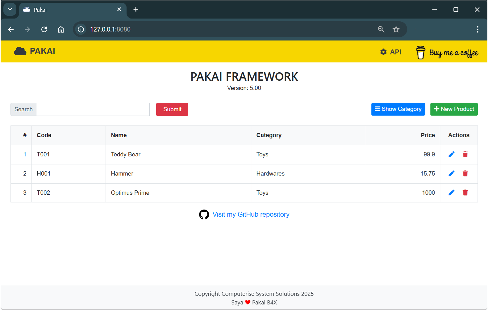

# Pakai Server - Web Application framework

Version: 6.80

B4J Fullstack Server Application and Web API Framework

### Preview


---

## Templates
- Pakai Server (6.80).b4xtemplate
- Pakai Server Api (6.80).b4xtemplate
- Pakai Server Web (6.80).b4xtemplate
- Pakai Server Starter (6.80).b4xtemplate

## Depends on
- [EndsMeet.b4xlib](https://github.com/pyhoon/EndsMeet)
- [MiniCSS.b4xlib](https://github.com/pyhoon/MiniCSS-B4X)
- [MiniHtml.b4xlib](https://github.com/pyhoon/MiniHtml2-B4X)
- [MiniJS.b4xlib](https://github.com/pyhoon/MiniJS-B4X)
- [MiniORMUtils.b4xlib](https://github.com/pyhoon/MiniORMUtils-B4X)
- [WebApiUtils.b4xlib](https://github.com/pyhoon/WebApiUtils-B4J)
- sqlite-jdbc-3.7.2.jar (SQLite)
- mysql-connector-j-9.3.0.jar (MySQL)
- mariadb-java-client-3.5.6.jar (MariaDB)

## Features
- Frontend using Bootstrap v5.3.8, Bootstrap Icons v1.13.1, HTMX v2.0.8, AlpineJS v3.15.8
- Responsive design with modal dialog and toast
- SQLite and MySQL/MariaDB backend
- Built-in REST API or CRUD examples

## Improvement
- Better UI/UX/DX compared to version 5.x
- More flexible to generate new models
- HTML generated using B4X
- No JavaScript module
- No jQuery AJAX parsing
- JSON/XML API supported
- WebApiUtils supported with HelpHandler

### Code Example
```b4x
Dim CacheName As String = "Categories Add Modal"
If ExistInCache(CacheName) = False Then
	WriteToCache(CacheName, ModalAdd)
End If
Dim modal1 As MiniHtml = ReadFromCache(CacheName)
Return modal1.build
```

**Support this project**

<a href="https://paypal.me/aeric80/"></a>
